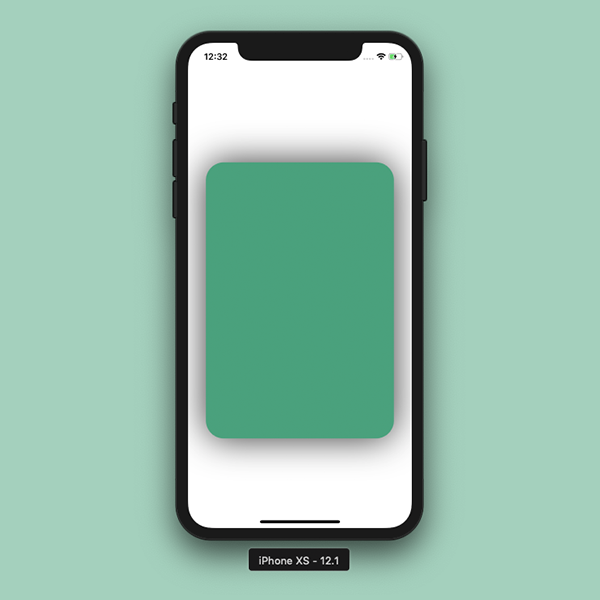

# RSCustomView
Creating a UIView with shadows and cornered radius is a lot more challenging than one may think. Using this helper class you can simply create a view with corner radius and shadows in no time at all. 

RoundedShadowViewHelper.swift file contains the custom helper class. Whenever you want to create a UIView with shadows and rounded corner just make a instance of RSCustomView class and use the custom initializer to pass the preferred values for shadowRadius, view's cornerRadius, shadowOffset, shadowOpacity & shadowColor.

